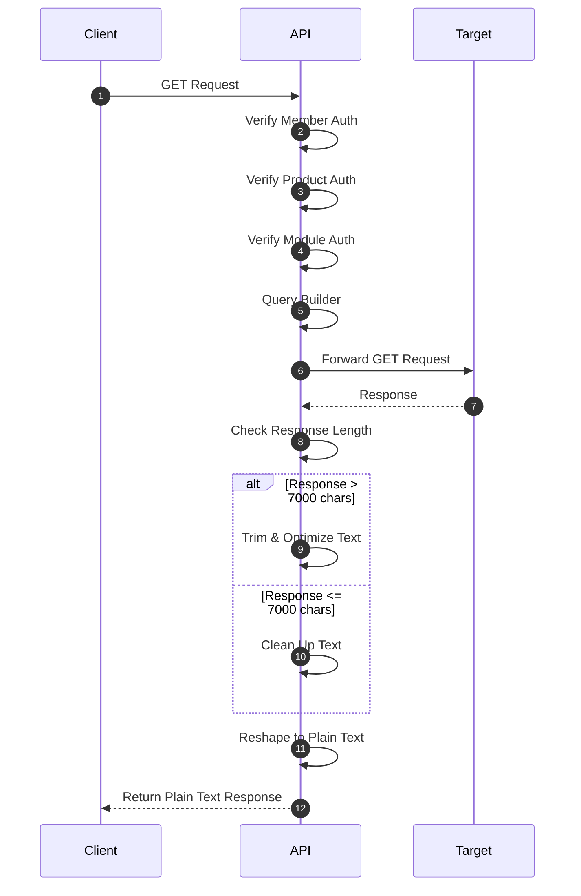

# MODKIT API PARSER

## cara kerja API

API ini bekerja dengan cara menerima permintaan dari klien, memprosesnya, dan mengembalikan respons yang sesuai. Berikut adalah langkah-langkah umum dalam proses ini:

## Tech Stack

- UV : Ultra Fast Python Product manager from astral.
- Python => 3.12
- fastapi>=0.116.1",
- loguru>=0.7.3",
- loguru-config>=0.1.0",
- markdown>=3.8.2",
- watchdog>=6.0.0",
