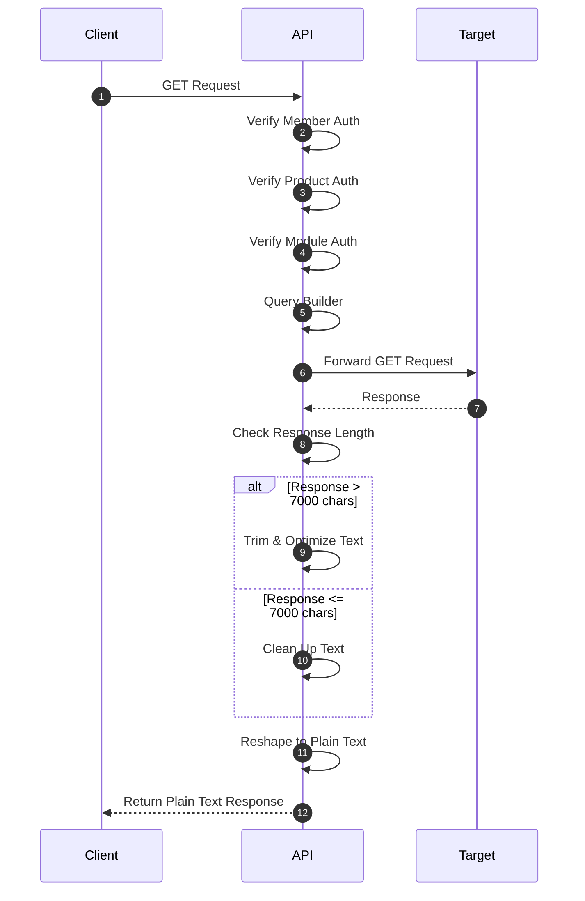

# MODKIT API PARSER

## cara kerja API

API ini bekerja dengan cara menerima permintaan dari klien, memprosesnya, dan mengembalikan respons yang sesuai. Berikut adalah langkah-langkah umum dalam proses ini:

## Penjelasan

1- ketika client menerima request GET : maka akan di verifikasi
